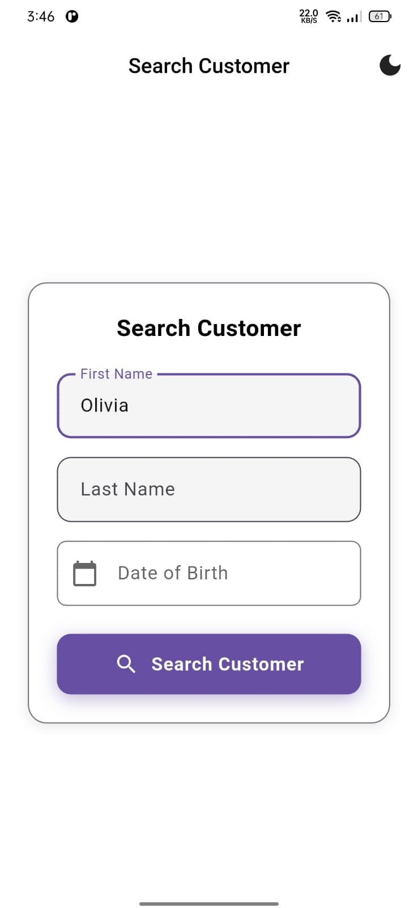
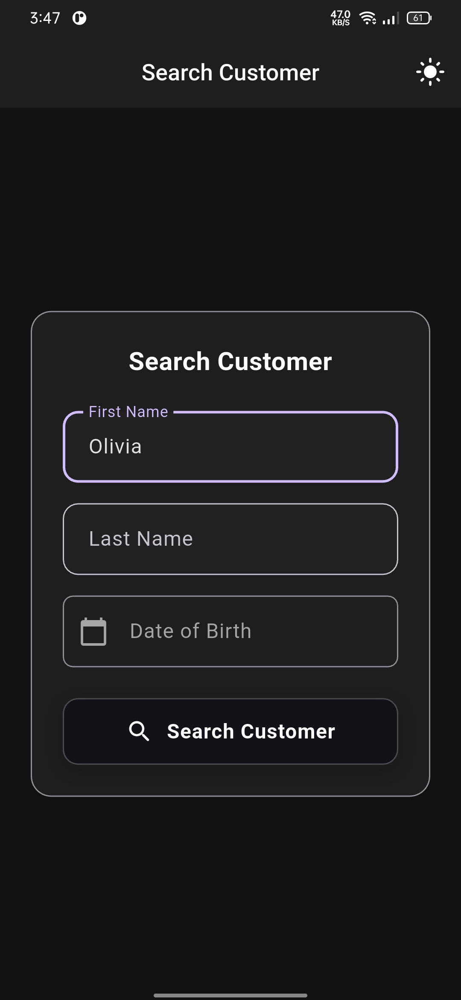
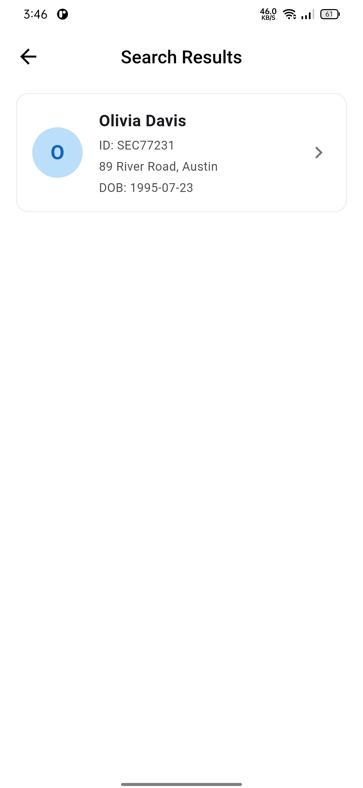
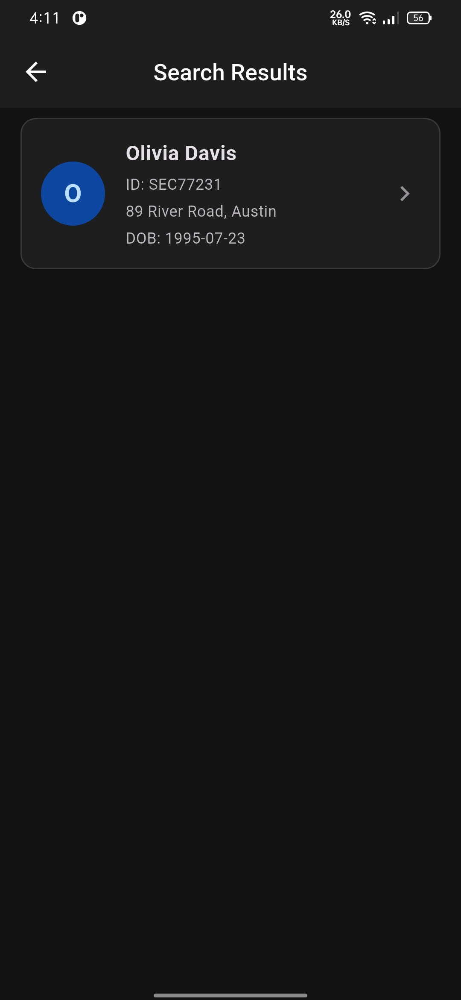
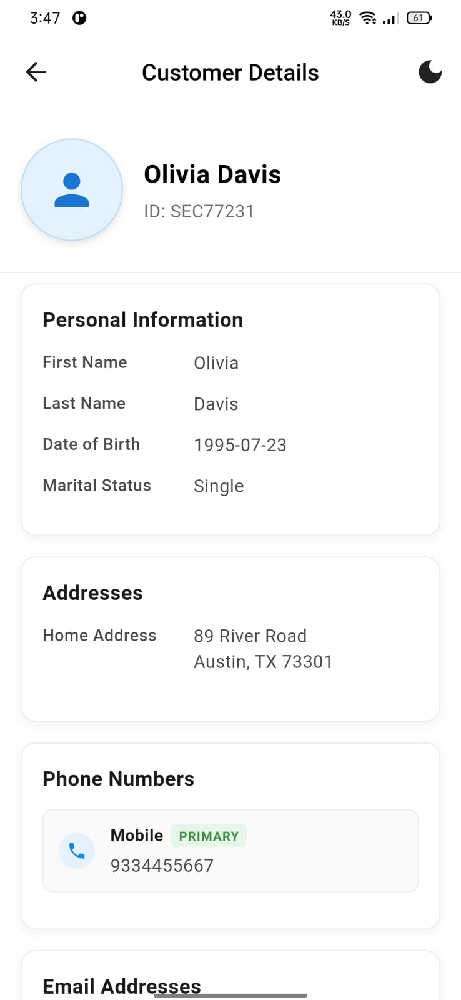
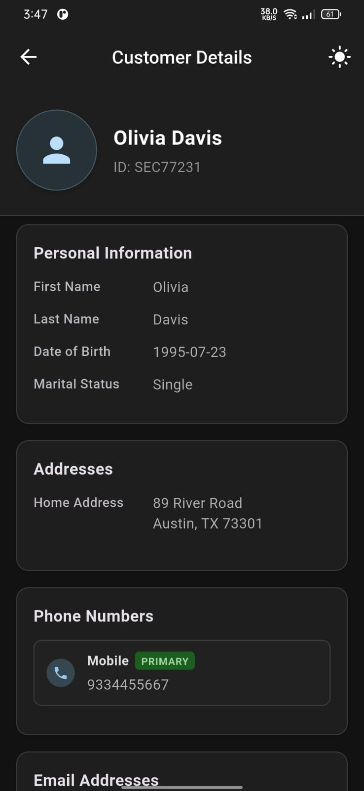

# Customer Search App

A Flutter application for searching and viewing customer information with a clean, responsive UI and theme support.

## 🌟 Features

### A. Search Screen
- 🔍 Dynamic search form with configurable fields
- ✨ Form fields rendered based on configuration
- 🔄 API integration for customer search
- 🗑️ Clear/Reset search functionality

### B. Results Screen
- 📋 Clean list view of matching customers
- 📱 Display: Name, DOB, Primary Phone, Primary Email
- 🔄 Pull-to-refresh functionality
- 📭 Empty state handling
- 👆 Tap to view detailed customer information

### C. Customer Detail Screen
- 📱 Organized customer information in sections:
  - Basic Information
  - Addresses (with type labels)
  - Phone numbers (highlighting primary)
  - Email addresses (highlighting primary)
- 🔙 Back navigation to results

### 🎨 Additional Features
- 🌓 Light/Dark theme support
- 🎬 Smooth animations for better UX
- 📱 Responsive design for different screen sizes

## 🚀 Getting Started

### Prerequisites
- Flutter SDK (latest stable version)
- Dart SDK (comes with Flutter)
- Android Studio / Xcode (for emulator/simulator)
- VS Code or Android Studio (recommended IDEs)

### Installation
1. Clone the repository:
   ```bash
   git clone https://github.com/Sushil-Jeengar/Customer-Search-Mobile-Application.git
   cd customer-search-app
   ```

2. Install dependencies:
   ```bash
   flutter pub get
   ```

3. Run the app:
   ```bash
   flutter run
   ```

### Platform-Specific Setup

#### Android
1. Ensure you have an Android emulator set up or a physical device connected
2. Run `flutter devices` to verify your device is detected
3. Run `flutter run -d <device-id>` to launch on a specific device

#### iOS
1. Install Xcode from the Mac App Store
2. Install Xcode command line tools:
   ```bash
   xcode-select --install
   ```
3. Install CocoaPods:
   ```bash
   sudo gem install cocoapods
   ```
4. Navigate to the ios folder and run:
   ```bash
   pod install
   ```
5. Open the project in Xcode and run from there, or use `flutter run`

## 🛠 Configuration Approach

The app uses a configuration-driven approach for the search form, defined in `lib/config/search_config.dart`. This allows for easy addition or modification of search fields without changing the UI code.

### Adding a New Search Field
1. Open `lib/config/search_config.dart`
2. Add a new field configuration to the `searchFields` list:
   ```dart
   SearchFieldConfig(
     id: 'new_field',
     label: 'New Field',
     type: FieldType.text, // or FieldType.date, FieldType.number, etc.
     isRequired: false,
   ),
   ```
3. The search form will automatically update to include the new field
4. The search functionality will include the new field in the API request

## 🎯 Why Flutter?

This project uses **Flutter** for several reasons:
- **Cross-platform**: Single codebase for both iOS and Android
- **Performance**: Native performance with Dart's AOT compilation
- **Hot Reload**: Faster development cycle
- **Rich Widget Library**: Beautiful, customizable UI components
- **Strong Community**: Extensive package ecosystem and community support

## 🔄 Trade-offs & Decisions

1. **State Management**: Used Provider for its simplicity and effectiveness for this scale of application
2. **API Integration**: Implemented a mock API service that can be easily replaced with a real backend
3. **Theming**: Implemented a theme provider for light/dark mode support
4. **Form Handling**: Used a configuration-based approach for the search form to make it more maintainable

## 📸 Screenshots

## 🔍 Search Screen
<p float="left">
  
  
</p>

## 📊 Result Screen
<p float="left">
  
  
</p>

## 📄 Detail Screen
<p float="left">
  
  
</p>
